#GitHub使用指南

##GitHub介绍
是一个面向开源及私有软件项目的托管平台  

GitHub于2008年上线，Github是一个从Ruby社区诞生出来的项目，可以说Git在Ruby社区普及和爆发几乎是必然的事情。Git虽然是Linux内核社区开发出来的，但前几年一直不温不火。真正在开源社区普及和爆发，是从Ruby社区和Github开始的。
  
2011年代码提交量对比图

托管的项目超过1000万

##注册
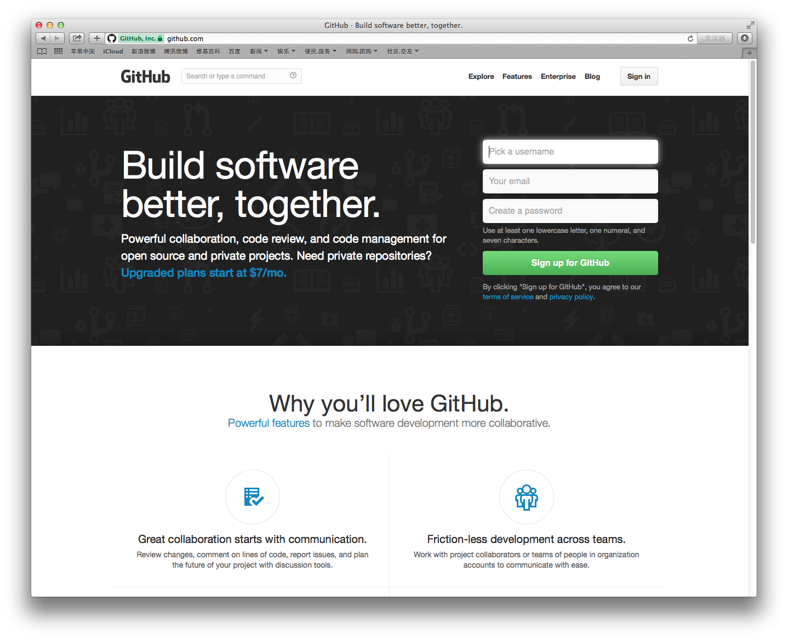
##配置SSH Key  
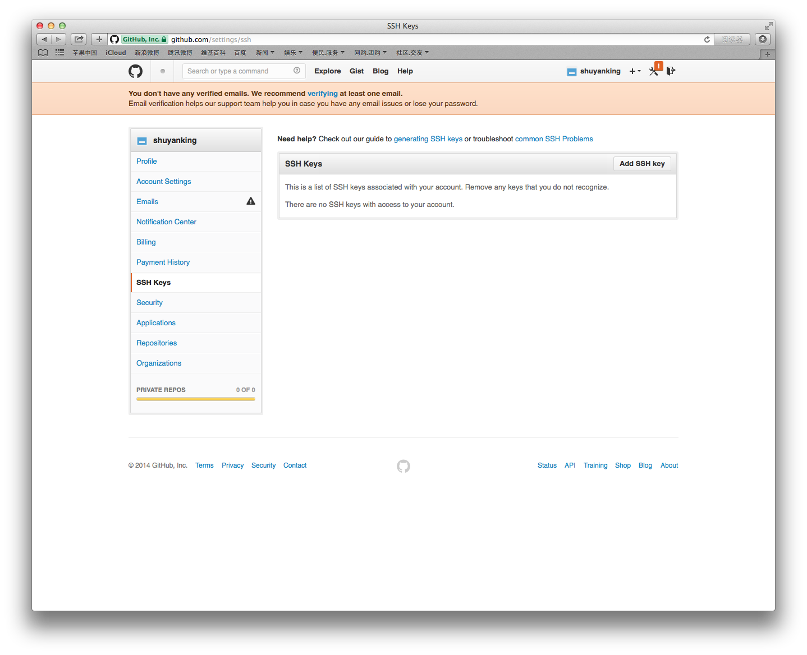

创建sshkey

     $ ssh-keygen -t rsa -C "your_email@example.com"   
     $ pbcopy < ~/.ssh/id_rsa.pub
     
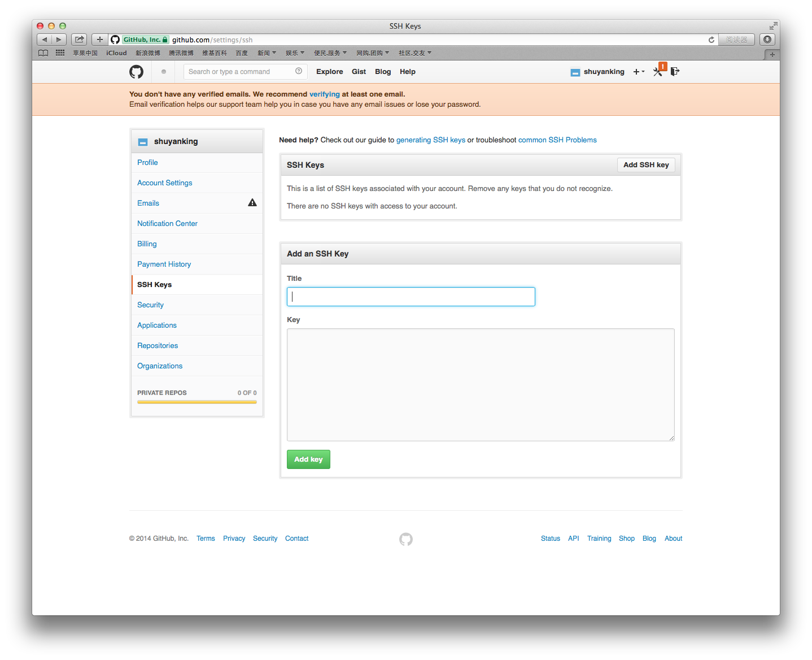

##新建项目
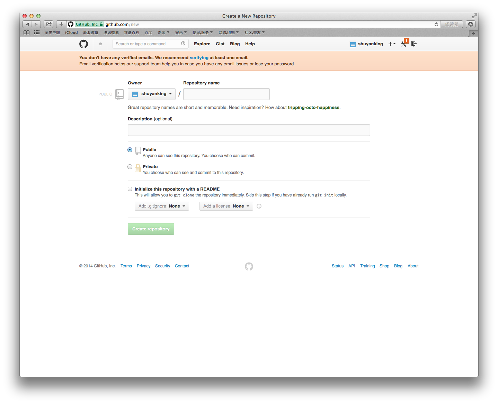
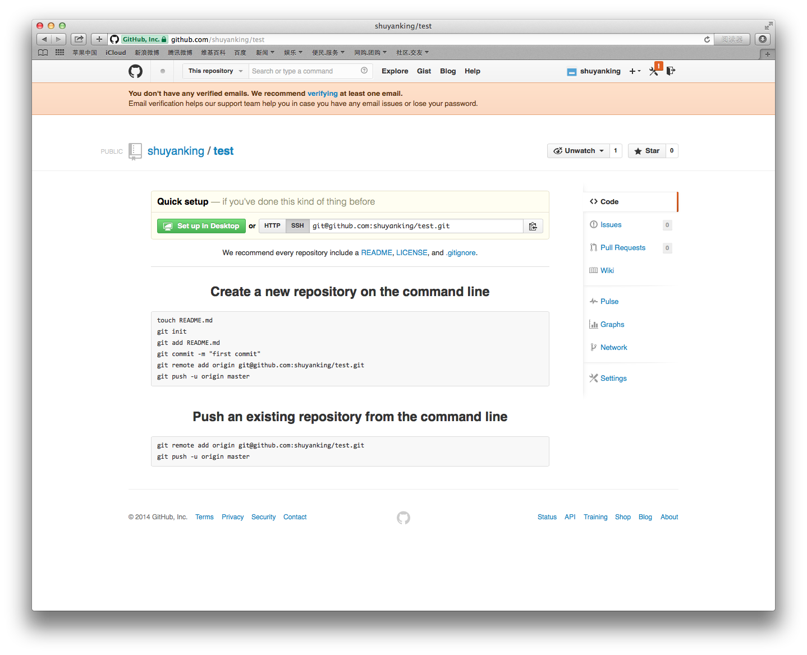

##Fork  

备份该项目的副本作为你自己的项目
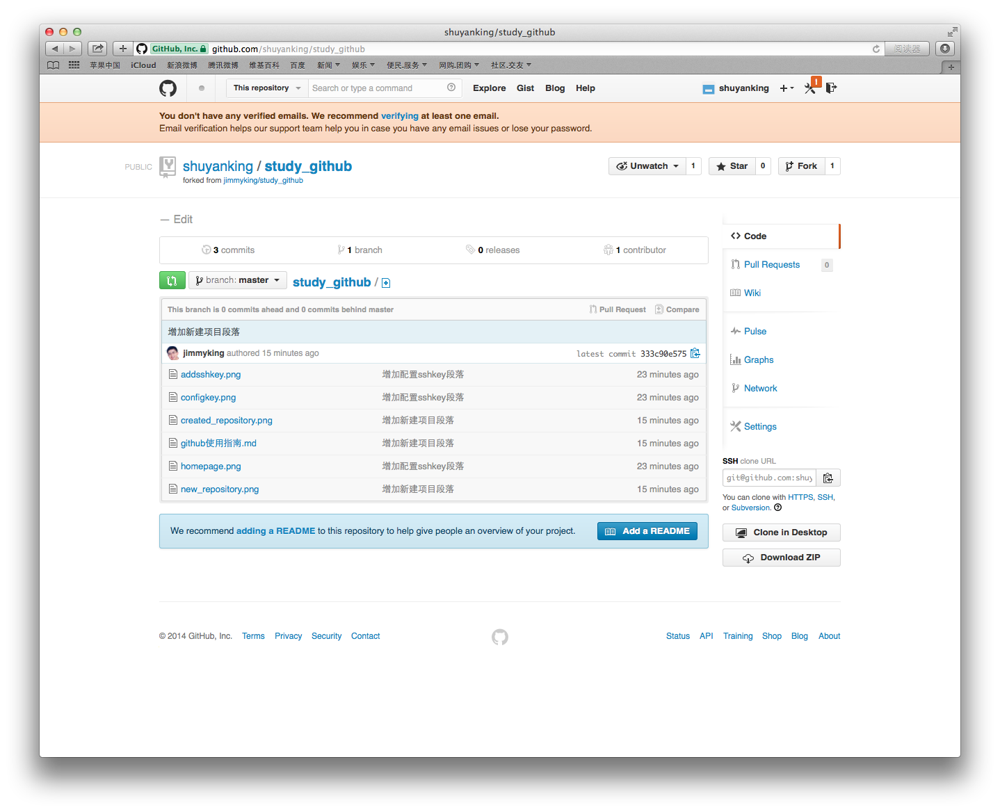

你可以在该项目中上任意修改，不会对原作者的项目造成任何的影响。
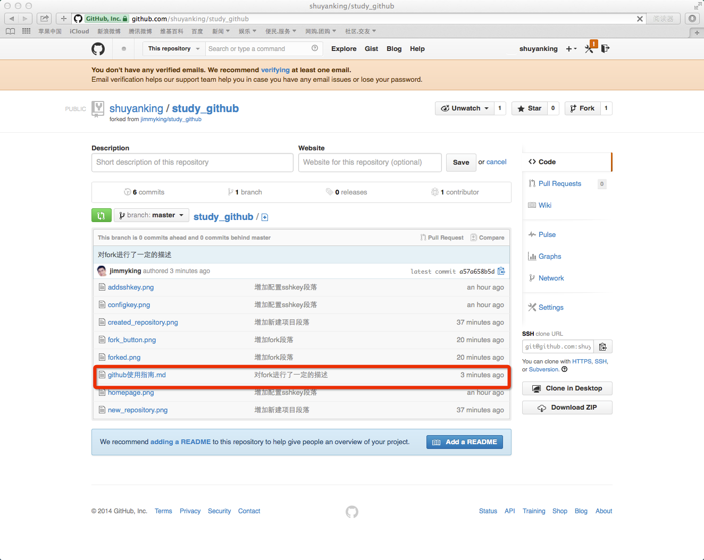
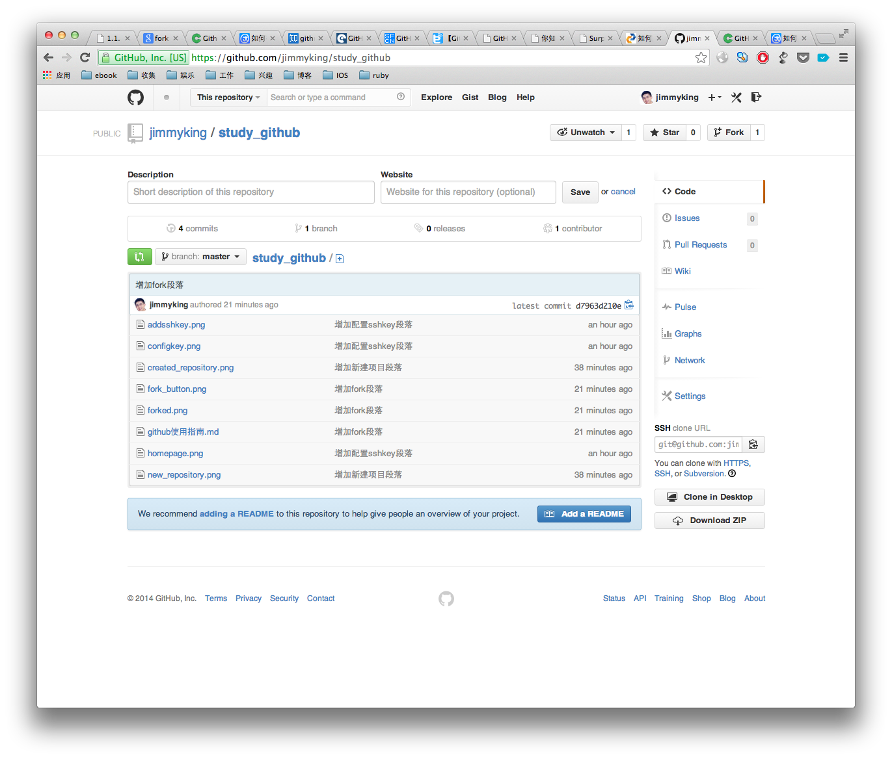

##Pull Requests
如果想将你的修改合并到原项目中时，可以pull request，这样原项目的作者就可以将你修改的东西合并到原项目的主分支上去，这样你就为开源项目贡献了代码。
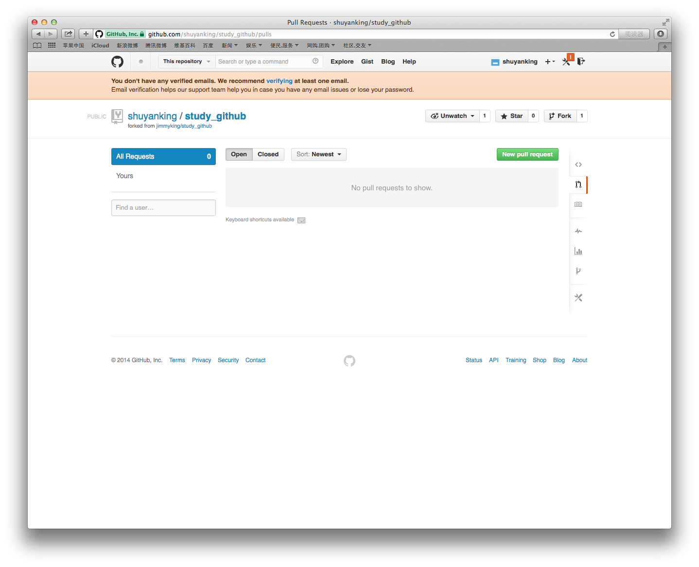
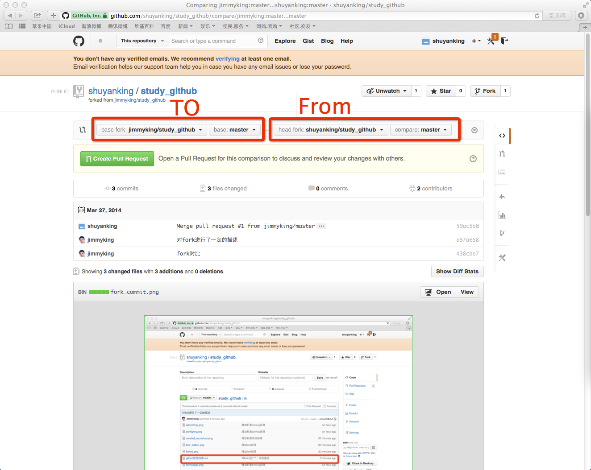
一旦你创建了pull_request给原作者，原作者将会收到通知和邮件
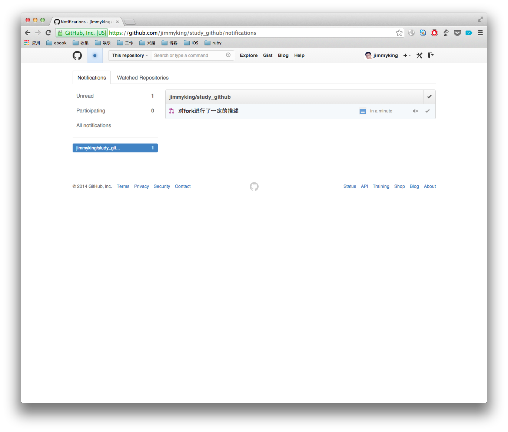
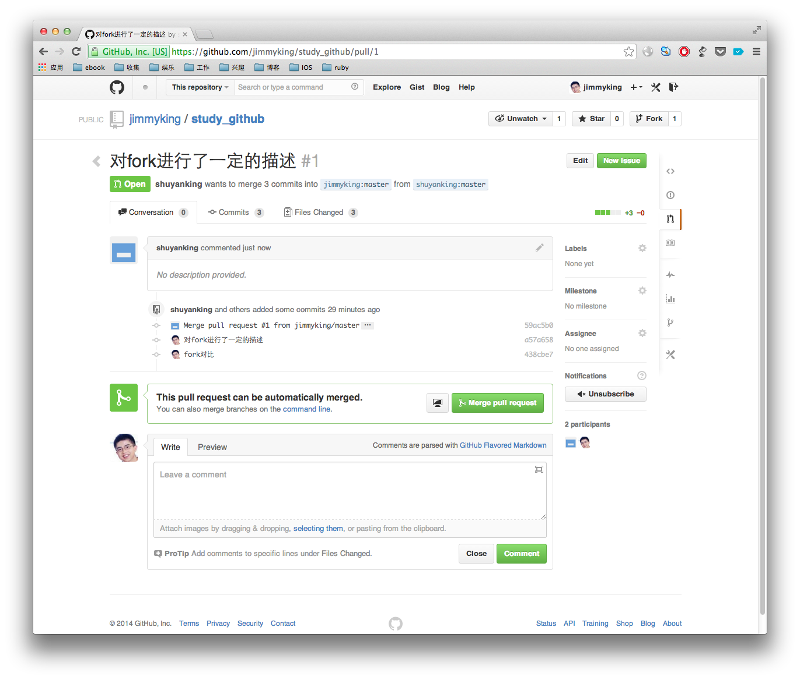
merge之后

这样你的代码就成功的被原作者接受
      

